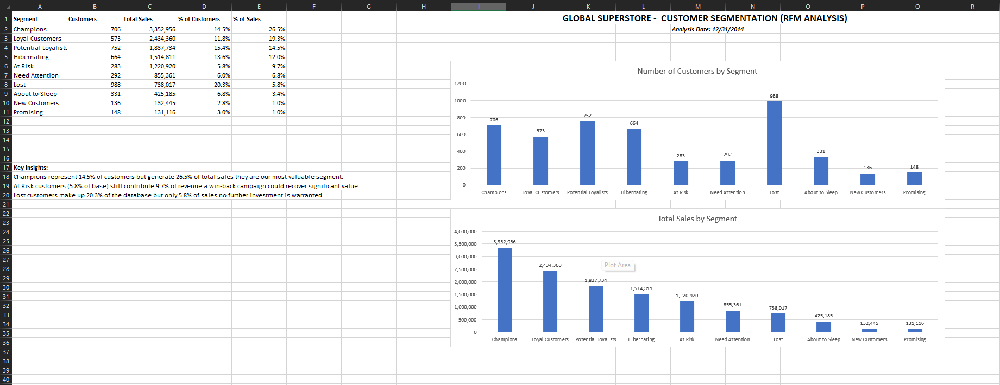
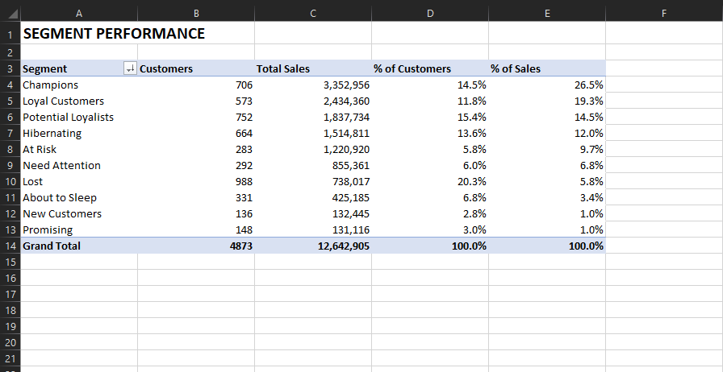
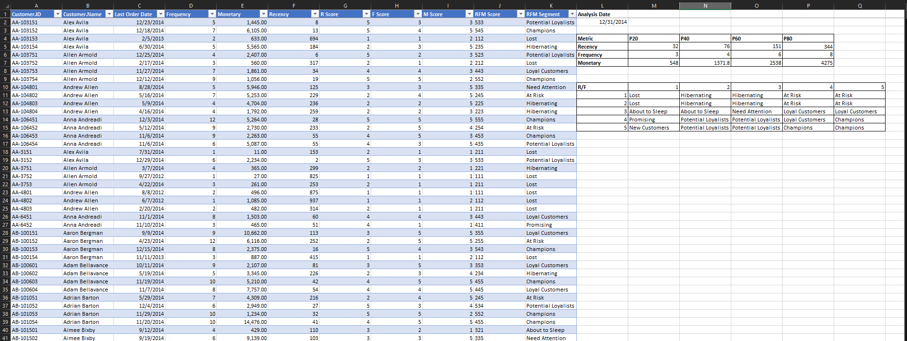

# Customer Segmentation with RFM Analysis (Excel)

RFM (Recency, Frequency, Monetary) customer segmentation of the **Global Superstore** dataset, built entirely in Microsoft Excel.

**Analysis date:** 31 December 2014  
**Customers:** 4,873  
**Total sales:** $12,642,905



## Project overview

Each customer is scored from 1 (low) to 5 (high) on three metrics, then mapped to a business segment:

| Metric | Meaning | Scoring |
|---|---|---|
| **Recency** | Days since last order | Lower days = higher score |
| **Frequency** | Unique order count | More orders = higher score |
| **Monetary** | Total sales | Higher spend = higher score |

Segments are assigned with an R x F lookup matrix (INDEX/MATCH). Monetary is used to measure value and to rank segments.

## Dataset

[Global Superstore (Kaggle)](https://www.kaggle.com/code/abdelazizelserty/global-superstore-dataset) - AbdelAziz version.

- One row = one order line (not one order)
- Date range used for recency: through **31 Dec 2014**
- Unique customer key: `Customer.ID` (not name - the same name can appear on multiple IDs)

The raw CSV is not stored in this repo. Import it with Power Query as described below.

## Workbook structure

| Sheet | Purpose |
|---|---|
| **Dashboard** | Charts, KPI table, and key insights |
| **Segment Summary** | PivotTable: customer count, sales, and mix by segment |
| **RFM Analysis** | One row per customer, scores, segment, breakpoints, and matrix |
| **Raw Data** | Power Query output (`tblOrders`) |
| **Customer Summary** *(hidden)* | Source PivotTable used to get distinct `Order.ID` counts |

## Method

### 1. Import

CSV imported with **Data > Get Data > From Text/CSV > Transform Data**. `Order.Date` typed as **Date** (the file stores `YYYY-MM-DD 00:00:00.000`; opening the CSV directly in Excel dropped the date and left `00:00`).

### 2. Customer grain

PivotTable on the Data Model with **Distinct Count** of `Order.ID` so Frequency = unique orders, not line items.

| Field | Aggregation |
|---|---|
| Last order date | MAX of `Order.Date` |
| Frequency | Distinct count of `Order.ID` |
| Monetary | SUM of `Sales` |

### 3. Recency

```text
Recency (days) = Analysis Date - Last Order Date
Analysis Date = MAX(Order.Date) = 31 Dec 2014
```

### 4. Scores (quintiles)

Breakpoints from `PERCENTILE.INC` (20 / 40 / 60 / 80):

| Metric | P20 | P40 | P60 | P80 |
|---|---:|---:|---:|---:|
| Recency (days) | 32 | 76 | 151 | 344 |
| Frequency (orders) | 3 | 4 | 6 | 8 |
| Monetary ($) | 548 | 1,372 | 2,538 | 4,275 |

- Recency: <= P20 = 5, then 4, 3, 2; > P80 = 1
- Frequency / Monetary: <= P20 = 1, then 2, 3, 4; > P80 = 5

Tied frequency values (whole numbers) are expected.

### 5. Segments

R score (rows) x F score (columns):



| R \ F | 1 | 2 | 3 | 4 | 5 |
|---:|---|---|---|---|---|
| 1 | Lost | Hibernating | Hibernating | At Risk | At Risk |
| 2 | Lost | Hibernating | Hibernating | At Risk | At Risk |
| 3 | About to Sleep | About to Sleep | Need Attention | Loyal Customers | Loyal Customers |
| 4 | Promising | Potential Loyalists | Potential Loyalists | Loyal Customers | Champions |
| 5 | New Customers | Potential Loyalists | Potential Loyalists | Champions | Champions |

Formula (row 2):

```excel
=INDEX($M$11:$Q$15,MATCH(G2,$L$11:$L$15,0),MATCH(H2,$M$10:$Q$10,0))
```

## Results

| Segment | Customers | % customers | Sales | % sales |
|---|---:|---:|---:|---:|
| Champions | 706 | 14.5% | $3,352,956 | 26.5% |
| Loyal Customers | 573 | 11.8% | $2,434,360 | 19.3% |
| Potential Loyalists | 752 | 15.4% | $1,837,734 | 14.5% |
| Hibernating | 664 | 13.6% | $1,514,811 | 12.0% |
| At Risk | 283 | 5.8% | $1,220,920 | 9.7% |
| Need Attention | 292 | 6.0% | $855,361 | 6.8% |
| Lost | 988 | 20.3% | $738,017 | 5.8% |
| About to Sleep | 331 | 6.8% | $425,185 | 3.4% |
| New Customers | 136 | 2.8% | $132,445 | 1.0% |
| Promising | 148 | 3.0% | $131,116 | 1.0% |
| **Total** | **4,873** | **100%** | **$12,642,905** | **100%** |



## Insights

- **Champions** are 14.5% of customers and 26.5% of sales - the highest-value group to retain and reward.
- **Champions + Loyal + Potential Loyalists** are 41.7% of customers and **60.3%** of revenue.
- **At Risk** is only 5.8% of customers but 9.7% of sales - a small win-back list with outsized value.
- **Lost** is 20.3% of the base and 5.8% of sales - do not spend heavily here.

## Suggested actions

| Segment | Action |
|---|---|
| Champions | Loyalty rewards, early access, ask for referrals |
| Loyal Customers | Cross-sell / upsell |
| Potential Loyalists / New / Promising | Second-purchase and onboarding offers |
| Need Attention / About to Sleep | Re-engagement before they lapse |
| At Risk | Personal win-back (they used to buy often and spend well) |
| Hibernating / Lost | Low-cost or no campaign |

## Excel skills used

- Power Query (CSV import, data types)
- Excel Tables (`tblOrders`, `tblRFM`)
- PivotTables + Data Model (**Distinct Count**)
- `PERCENTILE.INC`, `IFS`, `INDEX`/`MATCH`
- Dashboard layout and charts

## How to open

1. Download `Customer_Segmentation_RFM_Analysis.xlsx`.
2. Enable data connections if Excel prompts (needed for Power Query / the data model).
3. Start on **Dashboard**.

To rebuild from the Kaggle CSV: Data > Get Data > From Text/CSV > set `Order.Date` to Date > Close & Load as `tblOrders`.

## License

Analysis workbook: use freely for portfolio and learning.  
Data: Kaggle dataset license (see the dataset page).
```
